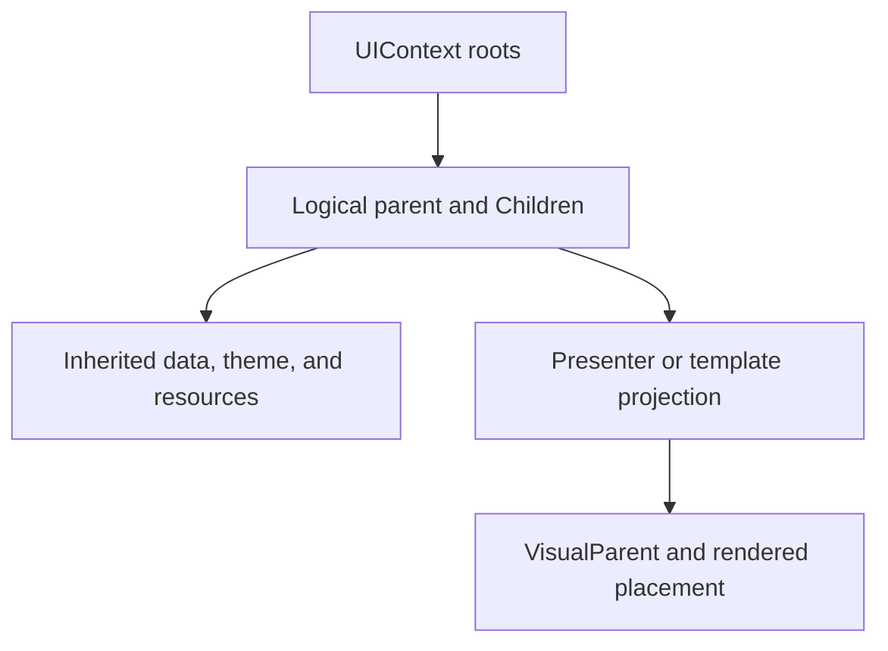

# Controls and containers

Forma retains a control tree between frames. Add a root to `UIContext`, mutate that tree in response
to game state or events, and let invalidation schedule layout and drawing.

`Control.AddChild` establishes logical ownership. Adding an already-owned control reparents it, and
self/descendant cycles are rejected. `Parent` and `Children` therefore answer who owns a control;
`VisualParent` answers where a presenter or template currently renders it. Projection does not
transfer inherited data, resources, or disposal responsibility away from the logical owner.

## Pick a composition type

| Need | Start with |
| --- | --- |
| Vertical or horizontal sequence | `VBoxContainer`, `HBoxContainer`, or `StackPanel` |
| Rows and columns | `GridContainer` for uniform cells; `GridPanel` for explicit tracks and spans |
| Wrapping or flexible distribution | `WrapPanel`, `FlowContainer`, or `FlexPanel` |
| One child with background, border, and padding | `Border` |
| One semantic content value and a template | `ContentControl` |
| Layers sharing a rectangle | `OverlayPanel` |
| Scrollable content | `ScrollContainer` or a control whose template owns a `ScrollPresenter` |
| Coordinates independent of sibling flow | `CanvasPanel` |

This compiled QuickStart view is one logical tree shared by both runtime hosts:

[!code-xml]

The root owns each label, field, and button. `ContentControl` is different: it accepts one content
value, replaces and detaches the old control, and uses `ContentTemplate` when content is data. A
control cannot be projected into two presenters simultaneously.

## Scrolling, overlays, and templates

Prefer a single scroll owner around content; nested same-axis scrollers make wheel and focus
behavior ambiguous. Use overlays for intentional layering such as popups or adorners, and use
`ZIndex` only to order siblings within that visual context.

`TemplatedControl.Template` may be null at construction. Resolution checks a control override, the
active theme, and packaged defaults when the template is applied. `TemplateRoot` is consequently
null until application. See [Templates and visual tree](xaml-templates-migration.md) for parts,
presenters, recycling, and compatibility rules.

## Common mistakes

- Do not infer ownership from `VisualParent`; inspect `Parent` for lifetime and inheritance.
- Do not manually keep a child in two containers. Reparent it or create another instance.
- Do not assign both a control content value and a `ContentTemplate` expecting adoption; the
  template treats that value as data.
- Do not choose `CanvasPanel` for ordinary forms that should respond to localization and resizing.

Browse the Catalog's
[composition systems](https://github.com/zigrok/Forma/blob/main/samples/Forma.Catalog/CompositionSystemsStoryView.xaml)
and [template systems](https://github.com/zigrok/Forma/blob/main/samples/Forma.Catalog/TemplateGalleryStoryView.xaml)
for executable combinations.
