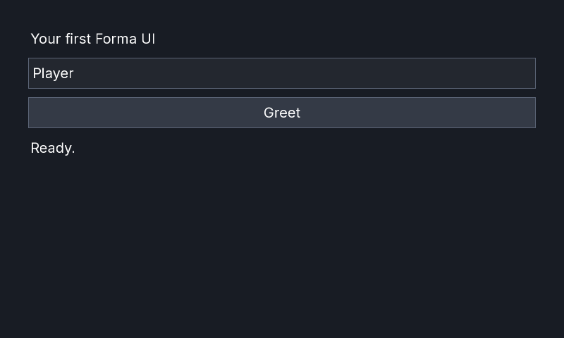

# Build your first UI in C\#

This route creates one retained control tree with a label, editable field, button event, and status
label. The shared view is compiled and smoke-tested against both runtime peers. The first public
NuGet preview is not indexed yet, so the current executable route uses this repository's source
projects rather than presenting unavailable package commands.

## Choose a host

Use the runtime already selected by the game. Forma's MonoGame and FNA APIs are equivalent, but the
assemblies are not interchangeable.

```sh
# MonoGame
dotnet run --project samples/Forma.QuickStart.MonoGame/Forma.QuickStart.MonoGame.csproj \
  -p:FormaRuntime=MonoGame

# FNA
dotnet run --project samples/Forma.QuickStart.FNA/Forma.QuickStart.FNA.csproj \
  -p:FormaRuntime=FNA
```

Both hosts use the same `QuickStartGame` and control-tree source. Each thin executable selects only
its matching framework and Forma project graph.

## Create the control tree

The page imports this block from the file compiled by both sample hosts:

[!code-csharp[](../examples/csharp-first-ui.cs)]

`VBoxContainer` owns its children and allocates them vertically. `CustomMinimumSize` prevents the
editable field and button from collapsing below useful input dimensions. `Pressed` updates the
retained status label directly; a redraw is queued by the changed property.

## Connect Forma to the game

`QuickStartGame` creates a `UIContext` and adds `UIComponent` to `Game.Components`. The component
forwards pointer, keyboard, and text input, updates `UIContext.ViewportSize` from the graphics-device
viewport, and draws the retained tree. The game keeps a 40-pixel inset and recomputes the root size
each update, so resizing the window reallocates all available content space.

The sample loads `Fonts/Inter_Regular.ttf` with `UIFontFace.FromProjectFile`, creates a
`DynamicUIFont`, and assigns it to `UIContext.Theme.FontFamily`. A game using SpriteFont instead can
assign `Font` properties or a `SpriteFontAdapter`; see [Dynamic text](../dynamic-text.md) for the
ownership and deployment choices.

`UIComponent.Dispose` disposes its `UIContext`. The game disposes the application-owned `UIFontFace`
after the base game and its components have been disposed. Preserve that ownership order when moving
the setup into an existing game.

## Expected result

MonoGame:



FNA:


Select the field, enter a name, and press **Greet**. The status changes to `Hello, <name>!`.

## Validate the fixture

The bounded smoke command restores from an empty package cache, builds the selected peer, renders
three frames, saves the backbuffer, verifies the PNG signature, exits, and disposes the game:

```sh
FORMA_RUNTIME=MonoGame bash scripts/check-quick-start.sh
FORMA_RUNTIME=FNA bash scripts/check-quick-start.sh
```

## Troubleshooting

- **Mixed runtime assemblies:** use only `.MonoGame` packages with MonoGame or only `.FNA` packages
  with FNA. Clean `bin`, `obj`, and lock files after changing peer.
- **Missing native assets:** FNA package consumers need the matching native-assets distribution.
  Native font loading also needs the RID assets described in [Dynamic text](../dynamic-text.md).
- **Missing font/content:** verify the file is copied beside the executable at
  `Fonts/Inter_Regular.ttf`. A content-pipeline SpriteFont requires its compiled XNB instead.
- **No graphics device:** graphical startup requires a supported desktop session and backend. Linux
  CI uses software graphics under Xvfb; see [Runtime support](../runtime-support.md).
- **XAML diagnostics:** this C# route does not invoke the XAML compiler. For declarative views, start
  with the [XAML language contract](../xaml-language.md) and keep the runtime and build-package peers
  aligned.
