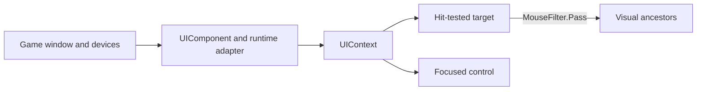

# Input and focus

`UIComponent` is the normal host adapter. It samples pointer and keyboard state, forwards the game
window's text-input stream, updates the viewport, draws the context, and installs the runtime peer's
clipboard implementation. The same QuickStart host and smoke gate exercise this path with MonoGame
and FNA.

## Pointer dispatch

Controls default to `IsHitTestVisible=true` and `MouseFilter.Stop`. `Stop` selects the topmost hit
and ends bubbling there. `Pass` allows the event to continue through visual ancestors. `Ignore`
removes that control from hit testing, but its descendants can still be hit. Call `AcceptEvent()`
to consume only the current dispatch.

The QuickStart's `LineEdit` and `Button` are retained input targets, and the button event mutates the
status label:

[!code-csharp]

## Focus and keyboard

Base `Control` defaults to `FocusMode.None`; interactive controls choose stronger defaults, and
`BaseButton` defaults to `FocusMode.All`. `Click` accepts pointer focus but is omitted from tab
traversal. `All` participates in both. Use `FocusNext`/`FocusPrevious` for explicit tab order and the
four `FocusNeighbor*` properties for directional navigation. Explicit neighbors override automatic
traversal.

`UIContext.FocusedControl`, `SetFocus`, `GrabFocus`, and `ReleaseFocus` expose the retained focus
state. Keyboard commands go to that stateful tree; character composition arrives separately through
`UIContext.TextInput` and `TextComposition`. Do not derive typed text from key codes.

## Text input and clipboard

Adding `UIComponent` subscribes the correct MonoGame or FNA `RuntimeTextInputAdapter`; disposing the
component unsubscribes it. `UIContext.Clipboard` supplies `IClipboard` to `LineEdit`, `TextEdit`, and
other editing controls. A host with a custom platform layer can replace that capability, while a
single `LineEdit` can override paste through `ClipboardTextProvider`.

Run the peer-specific fixture described in [Build your first UI in C#](getting-started/csharp-first-ui.md)
to validate the full adapter rather than invoking control internals directly.

## Common mistakes

- `MouseFilter.Ignore` does not disable hit testing for descendants; disable or restructure the
  subtree when that is required.
- The default `Stop` can prevent an ancestor from receiving pointer behavior, including tooltip
  discovery. Choose `Pass` intentionally for transparent wrappers.
- `FocusMode.Click` is not keyboard-tab focus. Use `All` when keyboard users must reach a control.
- `AcceptEvent()` does not create a persistent capture or disable later events.

Signal Run's [settings view](https://github.com/zigrok/Forma/blob/main/samples/Forma.Xaml.Game/GameSettingsView.xaml)
shows keyboard-reachable fields, toggles, and sliders in a complete application flow.
