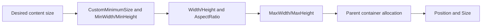

# Layout and sizing

Forma measures retained controls, applies constraints, and then lets the parent allocate the final
rectangle. Most application UI should express intent through minimums and container rules instead
of rewriting `Size` every frame.

## Choose the sizing control

| Need | Use | Notes |
| --- | --- | --- |
| Place a root or canvas child at an exact runtime rectangle | `Position` and `Size` | The host owns a root's available rectangle. Containers can replace a child's allocated size. |
| Keep a control usable while allowing growth | `CustomMinimumSize` | Combined with the control's content minimum; this is the normal application-level floor. |
| Set scalar layout constraints | `MinWidth`, `MinHeight`, `MaxWidth`, `MaxHeight` | Defaults are `0` and positive infinity. A minimum wins if it exceeds a maximum. |
| Request a direct dimension | `Width` or `Height` | Defaults are auto (`NaN`). One explicit axis can combine with `AspectRatio`. |
| Share surplus space in a container | `HorizontalSizeFlags`, `VerticalSizeFlags` | Defaults are `Fill`; add `Expand` to participate in surplus allocation. |
| Align without filling the allocated slot | `HorizontalAlignment`, `VerticalAlignment` | Both default to `Fill`. |

The QuickStart uses the recommended split: its host assigns the root `Size` from the viewport, while
the reusable controls declare `CustomMinimumSize` and size flags.

[!code-csharp]

## Containers and spacing

Use `StackPanel` for a simple axis, `WrapPanel` for wrapping, `FlexPanel` for flex-style distribution,
`GridPanel` for explicit tracks, `OverlayPanel` for layers, and `CanvasPanel` for coordinate-based
placement. `StackPanel` defaults to vertical orientation, zero gap, and stretched cross-axis items.
Its `Gap` and the classic `BoxContainer.Separation` are sibling spacing, not outer margin.

`Control.Margin` reserves space outside a child. Padding is supplied by controls that own an inner
content box, such as `Border`; it is not a universal `Control` property. Content controls separately
default `HorizontalContentAlignment` and `VerticalContentAlignment` to `Fill`.

Explore the executable Catalog stories for
[StackPanel](https://github.com/zigrok/Forma/blob/main/samples/Forma.Catalog/Stories/Controls/StackPanel.xaml),
[GridPanel](https://github.com/zigrok/Forma/blob/main/samples/Forma.Catalog/Stories/Controls/GridPanel.xaml),
and [FlexPanel](https://github.com/zigrok/Forma/blob/main/samples/Forma.Catalog/Stories/Controls/FlexPanel.xaml).

## Viewport and display scale

`UIComponent` updates `UIContext.ViewportSize` from the graphics-device viewport. A root whose size
is still zero adopts that logical viewport. Set `UIContext.DisplayScale` to physical pixels per
logical UI coordinate; the default is `1`. Forma maps pointer input back to logical coordinates,
scales drawing, invalidates scale-sensitive layout, and refreshes device-scoped glyph resources.

## Common mistakes

- Do not use `Size` as a minimum inside a container; use `CustomMinimumSize` or scalar minimums.
- Do not expect `MaxWidth` to violate a larger `MinWidth`; the minimum remains authoritative.
- Do not combine margins and padded content as if they occupy the same side of the border.
- After changing anchors, verify `keepOffset`: `false` preserves the resolved position, while `true`
  preserves the raw offset and can visibly move the control.

For XAML value syntax and attached grid placement, see the [XAML language contract](xaml-language.md).
