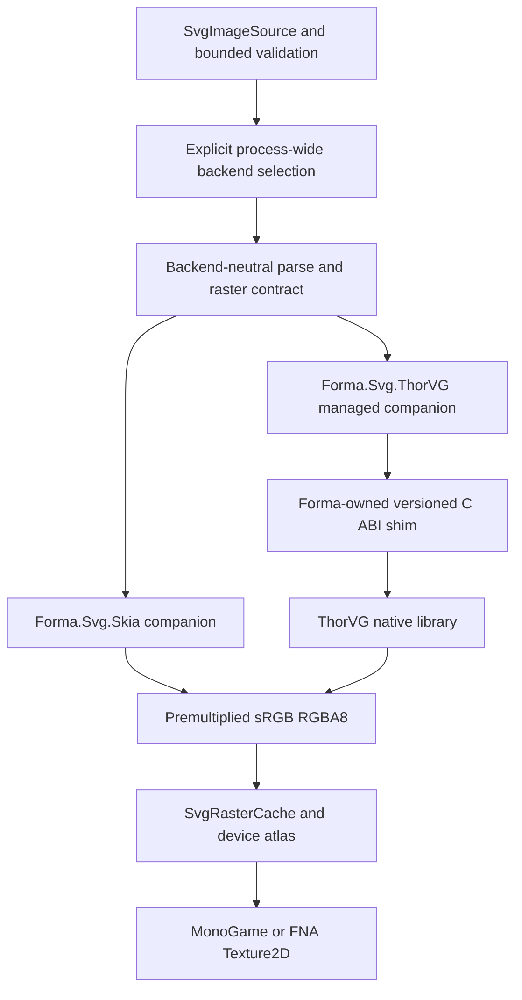

# Dual SVG Backends and ThorVG Console Readiness Implementation Plan

## Why This Matters to Forma Users

Forma's runtime SVG pipeline currently uses Svg.Skia and SkiaSharp. That backend is mature, produces
good desktop output, and already passes Forma's MonoGame, FNA, NativeAOT, cache, XAML, and visual
tests. Its native distribution model is nevertheless a poor foundation for claiming console
support: console ports generally require platform-specific native builds, static linking, restricted
toolchains, and platform-holder qualification rather than ordinary desktop runtime identifiers and
NuGet native assets.

ThorVG is a smaller embeddable native vector engine and is the SVG rasterizer used by Godot. Adding
it behind Forma's existing backend-neutral source and raster-cache boundaries can provide a more
credible console path without discarding Svg.Skia as the desktop reference backend. Applications
must be able to choose one backend explicitly, carry only that backend's managed and native
dependencies, and receive the same public Forma SVG behavior regardless of the selected rasterizer.

This work must not turn "ThorVG can be compiled from source" into an unsupported console promise.
Forma may call a target console-qualified only after the exact platform SDK, compiler, linker,
runtime, graphics backend, and lifecycle tests pass in an authorized environment. Public CI can
prove portable native builds, static-link architecture, NativeAOT, and backend conformance; private
platform CI owns proprietary console evidence.

## Objective

Evolve runtime SVG support from one implicitly Skia-backed companion into an explicit, deterministic
backend choice:

- retain Svg.Skia as a supported reference and desktop backend;
- add ThorVG as a second production backend through a narrow Forma-owned C ABI;
- keep SVG sources, validation, layout, raster caching, GPU upload, controls, XAML, and theme-icon
  behavior backend-neutral;
- permit dynamic native loading on supported desktop targets and static native linking for console
  or restricted NativeAOT targets;
- define and test one bounded Forma Runtime SVG Profile that both backends must implement;
- prevent either backend from becoming a transitive dependency of core Forma packages or of the
  other backend;
- distinguish portable, console-ready, and console-qualified support in package metadata and
  documentation.

This plan extends [Runtime SVG Rendering](runtime-svg-rendering-plan.md) and supersedes that plan's
initial non-goal of maintaining multiple production SVG backends. It does not change the public
`SvgImageSource`, scalable-image, XAML asset, theme-icon, or GPU cache model established there.

## Decision Summary

- **Backend model:** one SVG backend is selected for a process before the first document is parsed.
  Forma does not switch rasterizers per image or keep Skia and ThorVG active simultaneously.
- **Selection model:** backend installation is explicit and deterministic. There is no automatic
  per-document fallback from ThorVG to Skia and no reflection-based backend discovery.
- **Core boundary:** `SvgImageSource`, bounded validation, `SvgRasterCache`, controls, XAML, and GPU
  upload remain in core. Backend documents and CPU rasterization remain backend-owned.
- **Output contract:** every backend returns tightly packed, top-left-origin, premultiplied sRGB
  RGBA8 pixels with exact requested dimensions. Conversion occurs inside the backend, never in the
  GPU cache.
- **ThorVG interop:** managed code calls a Forma-owned versioned C ABI shim, not ThorVG's C++ ABI.
  The shim accepts caller-owned bounded bytes and buffers and performs no filesystem or network I/O.
- **Native linkage:** desktop packages may resolve a packaged dynamic library. Restricted and
  console builds may bind the same C ABI from a statically linked image through a documented host
  integration point.
- **Package identity:** new packages are backend-specific and runtime-matched, provisionally
  `Forma.Svg.Skia.MonoGame`, `Forma.Svg.Skia.FNA`, `Forma.Svg.ThorVG.MonoGame`, and
  `Forma.Svg.ThorVG.FNA`.
- **Compatibility packages:** existing `Forma.Svg.MonoGame` and `Forma.Svg.FNA` remain temporary
  Skia compatibility packages for one announced migration window. They must not silently change to
  ThorVG.
- **Dependency isolation:** ThorVG packages contain no Svg.Skia or SkiaSharp references; Skia
  packages contain no ThorVG native asset or build logic. Core packages contain neither.
- **Source provenance:** ThorVG source and build inputs are pinned reproducibly because static and
  console builds cannot depend only on desktop prebuilt binaries. Phase 0 records the exact version,
  commit, license, build options, patches, upstream reports, and update procedure.
- **Conformance:** Forma owns a supported runtime SVG profile. Capability claims derive from fixtures
  and output assertions, not from a backend's broad upstream SVG claim.
- **Parity:** layout, dimensions, alpha semantics, cache behavior, and supported-feature outcomes are
  equal. Cross-backend pixels use bounded perceptual/tolerance checks rather than byte-identical
  hashes where rasterizers legitimately differ.
- **Security:** core validation remains authoritative. Both backends reject external resources,
  scripts, animation, arbitrary fonts, and documents outside existing source/element/dimension/pixel
  budgets before unbounded native work.
- **Console claims:** "console-ready" means the architecture supports source builds and static
  linkage. "Console-qualified" requires passing the real target SDK matrix in authorized CI.

## Progress Dashboard

- [x] Phase 0: ThorVG Feasibility, Licensing, and Baselines
- [x] Phase 1: Backend Selection Contract and Skia Package Migration
- [x] Phase 2: Versioned ThorVG C ABI and Managed Backend
- [x] Phase 3: Desktop Native Builds and Package Isolation
- [x] Phase 4: Runtime SVG Profile and Cross-Backend Conformance
- [x] Phase 5: Cache, Lifetime, Threading, and NativeAOT Gates
- [x] Phase 6: Static Linking and Console Host Integration
- [x] Phase 7: Catalog, Tooling, Documentation, and Migration
- [x] Phase 8: Platform Qualification and Rollout

Check a phase only after every task and exit criterion in that phase is complete.

### Progress Tracking Workflow

Use the existing tracker at the start and end of each implementation session:

```sh
bash ../scripts/track-forma-plan.sh plans/dual-svg-backends-and-thorvg-plan.md
```

Add newly discovered required work to this document. Do not check a dashboard phase until all tasks
and exit criteria in that phase are checked. A proprietary platform result may be recorded as a
redacted pass/fail artifact, but no SDK paths, logs, symbols, or platform-confidential details belong
in this repository.

### Progress Reconciliation: 2026-08-06

Phases 0 through 7 are complete for the declared initial ThorVG matrix of macOS arm64 and Linux x64.
The evidence is the pinned ThorVG 1.1.0 source and native ABI smoke, backend-specific unit and profile
suites, clean package consumers, 492-raster comparison gate, MonoGame/FNA graphics lifecycle smoke,
dynamic and static NativeAOT hosts, Catalog smoke, fatal ASan/UBSan runs, notices, migration docs,
and backend-aware CI entry points. Windows x64 remains explicitly untested and outside the initial
ThorVG release matrix. No console is qualified; the public static host proves console-ready
architecture only. The resumed macOS arm64 and clean Linux x64 release matrices passed, and the
compatibility packages are scheduled for removal in Forma 1.0.0 after the warning-bearing `0.x`
migration window; Phase 8 is complete for this declared scope.

## Success Criteria

- [x] An application can select either Svg.Skia or ThorVG before first SVG use with no changes to
  `SvgImageSource`, `Image`, inline images, drawing surfaces, XAML assets, or theme-icon call sites.
- [x] Exactly one backend can be active in a process; duplicate, conflicting, late, and unavailable
  installations fail with stable actionable diagnostics.
- [x] Core Forma packages contain no Svg.Skia, SkiaSharp, ThorVG, native loader, or backend-specific
  public type.
- [x] Installing a ThorVG package resolves no Svg.Skia/SkiaSharp managed assembly or native asset,
  and installing a Skia package resolves no ThorVG asset.
- [x] Existing `Forma.Svg.MonoGame` and `Forma.Svg.FNA` consumers receive a documented compatibility
  path and do not silently change rasterizers.
- [x] Both backends satisfy the Forma Runtime SVG Profile for paths, shapes, strokes, transforms,
  gradients, clipping, masks, local references, style inheritance, opacity, view boxes,
  `preserveAspectRatio`, and `currentColor` at the exact profile level frozen in Phase 0.
- [x] Both backends return exact-size, tightly packed premultiplied RGBA8 output and satisfy
  `R <= A`, `G <= A`, and `B <= A` for every pixel.
- [x] Unsupported profile features fail with the same `SvgLoadErrorCode` category and bounded
  backend-specific detail rather than disappearing, performing I/O, or producing an empty image.
- [x] The 67 default theme SVGs and the full runtime SVG fixture corpus parse and rasterize through
  each backend at 1x, 1.25x, 1.5x, 1.75x, 2x, and 2.5x.
- [x] Warm-frame cache behavior remains backend-neutral: no parse, rasterization, native allocation,
  texture creation, or upload occurs for an unchanged source/key.
- [x] Backend identity and version are observable in health, metrics, smoke output, and failure
  diagnostics without exposing native handles.
- [x] Native document, raster, and library lifetimes survive repeated create/dispose, device reset,
  graphics-device teardown, and process shutdown under MonoGame and FNA.
- [x] The ThorVG shim performs no callbacks into managed code while rendering and owns no graphics
  device, `Texture2D`, file path, URI, or ambient process state.
- [x] The ThorVG backend passes trimming and NativeAOT tests on every declared public target.
- [x] The same ThorVG C ABI can be consumed through packaged dynamic loading and through a statically
  linked host adapter without changing Forma's SVG public API.
- [x] The declared initial desktop targets, Linux x64 and macOS arm64, pass ThorVG build,
  package-consumer, unit, render-smoke, and lifecycle checks. Windows x64 remains explicitly untested.
- [x] A console is listed as qualified only after its authorized private matrix passes static link,
  startup, raster corpus, cache pressure, device reset, suspend/resume, and shutdown checks.
- [x] Catalog and documentation make the active backend, native availability, profile support, and
  bitmap fallback visible and demonstrate both backends without requiring them in one process.
- [x] Licenses, notices, source provenance, symbols, and redistribution artifacts are complete for
  every shipped ThorVG binary.

## Non-Goals

- Promise console support based only on desktop builds, open-source CI, or Godot's use of ThorVG.
- Load both production backends and choose one automatically from SVG syntax or render failure.
- Provide per-image backend selection or migrate live backend documents between rasterizers.
- Fall back from ThorVG to Skia when ThorVG rejects a document; that would make package and runtime
  requirements nondeterministic.
- Expose ThorVG canvas, paint, accessor, animation, picture, surface, or native handle types in
  Forma's public API.
- Expose Skia types as part of the package split.
- Implement an SVG DOM, mutation API, animation engine, browser CSS engine, or arbitrary external
  resource loader.
- Make backend raster output byte-identical where antialiasing implementations legitimately differ.
- Build or distribute proprietary console SDK artifacts from public CI or NuGet.
- Require MonoGame or FNA to add SVG-specific graphics APIs; both continue receiving ordinary RGBA
  textures from Forma's existing cache.
- Replace `DrawingImage`, bitmap images, or the default theme's PNG fallback.
- Vendor unrelated ThorVG loaders, codecs, animation modules, or software-rendering features not
  required by the frozen runtime SVG profile.

## Current State

### Existing Strengths

- `SvgImageSource` is immutable, bounded, backend-neutral, and independent of graphics devices.
- `ISvgRasterizerBackend`, `ISvgBackendDocument`, and `SvgRasterData` already separate source parsing
  and CPU rasterization from cache and GPU upload.
- `SvgBackendRegistry` prevents backend replacement after the first parse, which is the correct
  lifetime rule for deterministic caches and backend-owned document handles.
- `SvgRasterCache` owns exact-size raster keys, bounded GPU atlas pages, diagnostics, eviction, reset,
  and device lifetime independently from Svg.Skia.
- `SvgBackendFeatures` and `SvgBackendHealth` provide an initial capability and availability model.
- `SvgBackendDefaults.Install()` statically registers the current backend without reflection-based
  discovery.
- Core source validation blocks external resources and enforces source, structure, and size budgets
  before Svg.Skia parsing.
- Runtime SVG already reaches controls, XAML, hot reload, package consumers, the Catalog, default
  theme icons, MonoGame, FNA, trimming, and NativeAOT.
- Backend tests already cover feature fixtures, exact raster dimensions, premultiplication,
  `preserveAspectRatio`, paint output, and every default theme SVG.

### Gaps to Close

- The optional assembly and package identity `Forma.Svg` implicitly means Svg.Skia, so consumers
  cannot select a backend from package metadata alone.
- Core grants internals access only to `Forma.Svg`; backend-specific assemblies need deliberate
  friend boundaries or a stronger internal adapter surface.
- `SvgBackendDefaults` and its health verification are Skia-specific despite their generic names.
- The global registry supports one backend lifetime correctly but does not identify the requested
  backend, distinguish conflicting package initializers, or provide a public explicit selection
  contract.
- The feature enum is smaller than the behavior exercised by the current corpus and cannot yet
  describe profile version, masks, styles, strokes, or static-link mode.
- Tests directly reach the internal global backend and run only against Svg.Skia in the main test
  process; the immutable registry prevents a trustworthy two-backend matrix in one process.
- There is no stable C ABI, native source pin, cross-build pipeline, package layout, or lifetime
  wrapper for ThorVG.
- Cache metrics identify SVG activity but not the selected backend/version in all reports and
  baseline artifacts.
- Current cross-platform claims rely on SkiaSharp's native assets and do not prove static linkage.
- No authorized console qualification contract, evidence schema, or support terminology exists.

## Target Architecture



### One Active Backend, Two Available Implementations

"Dual backend" means two independently installable implementations of one contract, not two active
rasterizers inside a render tree. Selection must complete before the first source is parsed. Once a
backend document or cache entry exists, changing backend would invalidate document types, output
expectations, metrics, and cache ownership. Production APIs therefore retain the current immutable
selection rule.

Tests compare backends by launching separate test processes or building separate backend-specific
test hosts. An internal test reset hook is allowed only if it proves that no source document, cache,
or graphics device survives the reset; process isolation remains the release gate.

### Proposed Backend Identity Contract

The exact public names are frozen in Phase 1, but the contract must represent:

```text
backend id          stable machine identity: skia or thorvg
display name        diagnostic name
backend version     Svg.Skia or ThorVG version
profile version     Forma Runtime SVG Profile version
features            tested profile capabilities
native availability packaged, host-provided, unavailable
link mode           managed, dynamic native, static host
diagnostic          bounded actionable detail
```

`SvgRuntime.Health` remains safe before graphics-device creation. Health probing must not parse
ambient files, start worker threads, allocate an unbounded surface, or make a console host load an
unselected backend.

### ThorVG C ABI Boundary

The shim owns C-compatible entry points with fixed-width types and an explicit ABI version. The
initial conceptual surface is:

```c
uint32_t forma_thorvg_abi_version(void);
forma_svg_result forma_thorvg_version(forma_svg_version* output);
forma_svg_result forma_thorvg_document_create(
    const uint8_t* source, size_t source_length, forma_svg_document** output);
forma_svg_result forma_thorvg_document_rasterize(
    forma_svg_document* document,
    uint32_t width,
    uint32_t height,
    uint8_t* rgba,
    size_t rgba_length);
void forma_thorvg_document_destroy(forma_svg_document* document);
```

Phase 0 may refine names and required initialization, but the final ABI must preserve these rules:

- no C++ class, standard-library type, exception, allocator object, or compiler-specific enum crosses
  the boundary;
- all ownership is explicit and every create has an idempotent managed lifetime wrapper;
- source is bytes plus length, never a path or URI;
- raster memory is caller-owned and exactly `width * height * 4` bytes;
- results use stable Forma error codes plus a bounded copied diagnostic;
- C++ exceptions never cross the boundary;
- no managed callback is invoked while ThorVG holds native locks or paint state;
- output is normalized in the shim to Forma's premultiplied RGBA8 contract;
- ABI version mismatch fails during installation before the first document parse;
- dynamic and static linkage expose the same symbols and behavior.

### Package and Assembly Shape

Provisional production packages:

| Package | Managed backend | Native dependency | Purpose |
| --- | --- | --- | --- |
| `Forma.Svg.Skia.MonoGame` | `SvgSkiaBackend` | Svg.Skia/SkiaSharp assets | Explicit Skia backend |
| `Forma.Svg.Skia.FNA` | `SvgSkiaBackend` | Svg.Skia/SkiaSharp assets | Explicit Skia backend |
| `Forma.Svg.ThorVG.MonoGame` | `SvgThorVGBackend` | Forma ThorVG shim/library | Explicit ThorVG backend |
| `Forma.Svg.ThorVG.FNA` | `SvgThorVGBackend` | Forma ThorVG shim/library | Explicit ThorVG backend |
| `Forma.Svg.MonoGame` | compatibility initializer | Skia package dependency | Time-bounded migration |
| `Forma.Svg.FNA` | compatibility initializer | Skia package dependency | Time-bounded migration |

The project layout may share backend implementation source between runtime peers, but produced
packages must retain the existing MonoGame/FNA graph guards. Default-theme SVG source resources
must not be duplicated into every backend package without a measured reason; Phase 1 decides whether
they move to core, a backend-neutral source companion, or one shared generated assembly.

### Runtime SVG Profile

Forma supports a bounded profile, not whichever union of features happens to render in one backend.
Phase 0 freezes a versioned fixture manifest covering at least:

- root dimensions, view boxes, percentages accepted by current source validation, and
  `preserveAspectRatio` modes;
- paths and basic shapes;
- fills, strokes, opacity, fill rules, caps, joins, miter limits, and dash arrays;
- affine transforms and nested groups;
- linear and radial gradients with supported spread and transforms;
- clipping and masks at the level both production backends can guarantee;
- local `defs`/`use` references and fragment references;
- bounded style attributes/classes and inheritance already accepted by Forma;
- `currentColor` and Forma's existing tint/modulation behavior;
- explicit rejection of external resources, scripts, animation, arbitrary fonts, and unsupported
  filter/effect behavior.

Features outside the intersection remain rejected or documented as backend extensions that Forma
does not rely on. Default theme icons and first-party samples may use only the common profile.

### Conformance Comparison Policy

Each fixture declares the assertions appropriate to its purpose:

- exact dimensions, buffer length, origin, stride, and premultiplication;
- exact transparent/opaque semantic sample points where antialiasing is irrelevant;
- bounded alpha-coverage and bounding-box differences;
- bounded mean and percentile channel error after premultiplication;
- backend-specific stable hashes only for detecting changes within one backend/version;
- explicit review images for intentional rasterizer differences.

Cross-backend byte hashes are not a release requirement. A tolerance cannot hide missing shapes,
empty output, incorrect clipping, shifted geometry, straight-alpha output, or out-of-bounds writes.

## Implementation Phases

### Phase 0: ThorVG Feasibility, Licensing, and Baselines

#### Tasks

- [x] Select and record the latest ThorVG release/commit that passes the spike; document its license,
  source URL, checksums, build system, SVG loader options, software raster engine options, and update
  policy.
- [x] Add a decision record comparing continued Skia-only support, replacement, and explicit dual
  packages across desktop quality, binary size, NativeAOT, source builds, static linking, maintenance,
  and console qualification.
- [x] Build a throwaway native spike on macOS arm64 and Linux x64 that loads SVG bytes and renders
  into a caller-provided buffer without filesystem access.
- [x] Prove or reject Windows x64 support using the intended compiler and CRT linkage model.
- [x] Measure stripped native binary size, cold initialization, parse time, raster time, and peak
  allocation against the current Svg.Skia benchmark corpus.
- [x] Run the 67 default theme icons and current backend feature fixtures through unmodified ThorVG;
  classify pass, visual difference, unsupported feature, crash, leak, and required shim behavior.
- [x] Determine ThorVG's native color order, alpha mode, row order, stride behavior, and ownership
  experimentally; add a known semitransparent pixel proof rather than relying on documentation alone.
- [x] Verify that the required ThorVG modules can be built without network, font, image codec,
  animation, or unrelated loader dependencies.
- [x] Decide pinned source delivery: submodule or integrity-checked source archive. Record why the
  choice is reproducible for private console builds.
- [x] Freeze Runtime SVG Profile v1 from the intersection of required Forma behavior and proven
  backend output; list every current fixture excluded or changed.
- [x] Define numerical conformance tolerances from measured output differences and include examples
  that would fail despite a superficially similar image.
- [x] Record whether the plan remains viable. If required default-theme/profile behavior cannot be
  supported safely, stop before production package work and retain Skia only.

#### Exit Criteria

- [x] ThorVG produces bounded non-empty output for the approved profile on macOS arm64, Linux x64,
  and Windows x64, or unsupported public targets are explicitly removed from the initial scope.
- [x] License, provenance, source pin, build dependencies, binary-size delta, performance delta, and
  feature gaps are reviewed and recorded.
- [x] Runtime SVG Profile v1 and cross-backend tolerance rules have checked-in fixture manifests.
- [x] A written go/no-go decision approves the production C ABI work.

### Phase 1: Backend Selection Contract and Skia Package Migration

#### Tasks

- [x] Add a stable backend id, profile version, native source/link mode, and bounded diagnostic to
  backend health while preserving source compatibility where practical.
- [x] Rename generic Skia implementation types such as `SvgBackendDefaults` to explicit Skia names;
  provide obsolete forwarding APIs only where they prevent unnecessary consumer breakage.
- [x] Keep the registry process-wide and immutable after first parse, but make conflict diagnostics
  name both the selected and attempted backend ids.
- [x] Define an explicit installation API that is trim-safe, NativeAOT-safe, and does not use assembly
  scanning or reflection discovery.
- [x] Add tests for no backend, successful explicit selection, repeated same-backend installation,
  conflicting installation, late installation, unavailable native library, and ABI/profile mismatch.
- [x] Create backend-specific Skia projects/packages and preserve current MonoGame/FNA guards.
- [x] Convert existing `Forma.Svg.MonoGame` and `Forma.Svg.FNA` into documented compatibility
  packages that depend on and initialize Skia for one migration window.
- [x] Update `InternalsVisibleTo` deliberately for backend assemblies, or add one constrained public
  adapter surface if friend assembly proliferation would weaken ownership.
- [x] Decide where the 67 embedded default-theme SVG sources live so both backends consume one
  authoritative resource set without acquiring each other's dependencies.
- [x] Add restore-graph tests proving core, Skia, ThorVG placeholder, and compatibility package
  isolation before ThorVG implementation lands.

#### Exit Criteria

- [x] Existing applications using compatibility packages render through Skia unchanged with a clear
  migration warning and documented replacement package.
- [x] New Skia package consumers select `skia` explicitly and pass all existing runtime SVG tests.
- [x] Conflicting or late selection cannot create mixed document/cache state.
- [x] Core package asset and dependency audits contain no backend implementation.

### Phase 2: Versioned ThorVG C ABI and Managed Backend

#### Tasks

- [x] Add the pinned ThorVG source/build input and Forma shim under an isolated native directory with
  reproducible debug/release build commands.
- [x] Implement ABI version, backend version, document create/destroy, rasterize, and bounded error
  retrieval functions using fixed-width C-compatible types.
- [x] Disable C++ exceptions across the exported boundary or catch and translate every exception
  before returning.
- [x] Load only validated in-memory SVG bytes; disable or reject external file, URI, font, script,
  animation, image, and callback behavior.
- [x] Normalize native output to top-left premultiplied sRGB RGBA8 and reject unsupported native
  color-space or stride configurations.
- [x] Add checked arithmetic for source length, width, height, stride, and total raster bytes on both
  managed and native sides.
- [x] Wrap native documents in a `SafeHandle` or equally rigorous idempotent ownership type that is
  trim/AOT compatible and cannot outlive the loaded native API table incorrectly.
- [x] Implement `SvgThorVGBackend` behind `ISvgRasterizerBackend` with stable error mapping and no
  `Texture2D` or graphics-device dependency.
- [x] Add health probing that verifies ABI version and a 1x1 bounded raster without ambient I/O.
- [x] Add native unit tests for nulls, zero lengths, truncated SVG, invalid dimensions, undersized
  output buffers, repeated destruction, error truncation, and allocation failure.
- [x] Add managed tests for wrong document type, disposed document, missing symbol, ABI mismatch,
  unavailable native library, and native error translation.
- [x] Run AddressSanitizer and UndefinedBehaviorSanitizer where supported; run the platform leak tool
  selected in Phase 0 over repeated parse/raster/dispose loops.

#### Exit Criteria

- [x] The shim exposes only the reviewed versioned C ABI and exports no C++ implementation contract.
- [x] Managed ThorVG parsing/rasterization passes ownership, bounds, premultiplication, and failure
  tests without leaks or sanitizer findings.
- [x] The backend can be installed and verified without creating a MonoGame/FNA graphics device.

### Phase 3: Desktop Native Builds and Package Isolation

#### Tasks

- [x] Produce deterministic ThorVG shim binaries for the initial desktop RID matrix with symbols
  separated according to repository release policy.
- [x] Package dynamic native assets under correct NuGet runtime paths without runtime downloads,
  post-install scripts, or machine-global library lookup.
- [x] Add package-time ABI/version validation so managed and native components cannot drift silently.
- [x] Add backend-specific package initializers and MonoGame/FNA graph guards.
- [x] Verify single-file, self-contained, framework-dependent, trimmed, and NativeAOT publish layouts
  for each declared RID.
- [x] Verify applications that reference only ThorVG contain no `Svg.Skia`, `SkiaSharp`, or Skia
  native assets using package-lock and publish-directory audits.
- [x] Verify applications that reference only Skia contain no ThorVG shim, source, symbols, or build
  targets.
- [x] Verify applications with no SVG companion retain current missing-backend behavior and contain
  neither native engine.
- [x] Add clean-machine package consumer tests for C# sources, compiled XAML SVG assets, default
  theme icons, and explicit backend verification.
- [x] Record compressed package size, published size, loaded native size, and startup impact for each
  backend/RID.

#### Exit Criteria

- [x] Every declared desktop ThorVG package restores and runs on a clean matching host.
- [x] Dependency and publish audits prove complete backend isolation.
- [x] Package guards reject mixed MonoGame/FNA peers and incompatible managed/native ABI versions.
- [x] Size and startup regressions are within the Phase 0 budgets or explicitly approved.

### Phase 4: Runtime SVG Profile and Cross-Backend Conformance

#### Tasks

- [x] Move backend-independent fixtures and expected semantics into a shared conformance project that
  can run in separate Skia and ThorVG processes.
- [x] Cover every Runtime SVG Profile v1 feature with positive output assertions and every excluded
  feature with deterministic rejection assertions.
- [x] Run all default theme SVG resources and compiled XAML SVG fixtures through both backends.
- [x] Add cross-backend image comparison tooling implementing the approved alpha-coverage,
  geometry-bound, mean-error, and percentile-error rules.
- [x] Store backend-specific hashes and versions for within-backend regression detection; do not use
  one backend's hash as the other's expected output.
- [x] Add semitransparent gradient, mask, clip-edge, stroke-cap, dash, nested-transform, local-use,
  view-box, and `currentColor` sample-point assertions.
- [x] Verify malformed/adversarial sources map to equivalent public error categories and do not crash,
  hang, allocate outside budgets, or access the filesystem/network.
- [x] Add fuzz seeds from the validated profile and run managed validation plus the ThorVG shim under
  bounded fuzz time in scheduled CI.
- [x] Ensure first-party theme SVGs and Catalog assets use only profile features; update assets rather
  than introducing hidden Skia dependencies.
- [x] Generate human-review contact sheets for both backends at all approved scales and record every
  accepted visible difference.

#### Exit Criteria

- [x] Both backend-specific conformance runs pass the same profile manifest and public error contract.
- [x] Cross-backend comparisons stay within approved tolerances with no missing, shifted, clipped,
  empty, or alpha-invalid output.
- [x] Every default theme icon is approved on both backends at fractional and Retina scales.
- [x] Security and fuzz gates report no unbounded work, native crash, or external I/O.

### Phase 5: Cache, Lifetime, Threading, and NativeAOT Gates

#### Tasks

- [x] Confirm all parsed-document caches are scoped to the immutable selected backend and never reuse
  a document across backend-specific test processes.
- [x] Include backend id/version/profile in cache diagnostics and benchmark artifacts without changing
  deterministic raster keys unnecessarily after selection is frozen.
- [x] Verify cache hit/miss/eviction behavior, atlas placement, frame-safe disposal, device reset, and
  GPU upload counts are identical at the contract level for both backends.
- [x] Stress repeated source creation, parse, multi-scale rasterization, eviction, context disposal,
  device reset, and graphics-device teardown under MonoGame and FNA.
- [x] Verify native document handles can be disposed on their documented owner thread and define
  behavior when finalization occurs after host shutdown.
- [x] Decide and enforce the ThorVG thread-safety model. Do not add background rasterization until
  isolated documents and native global initialization pass concurrent stress tests.
- [x] Run parse/raster races, cancellation boundaries, and cache prewarm tests if background work is
  enabled; keep `Texture2D` creation and upload on the render thread.
- [x] Add trim warnings as errors and NativeAOT consumers for both backends, including missing-native,
  static-host, and package-dynamic configurations where applicable.
- [x] Compare cold parse/raster, warm lookup, allocations, cache memory, upload count, and frame time
  against Svg.Skia baselines and Phase 0 ThorVG budgets.
- [x] Run complete render smoke repeatedly on packaged FNA and MonoGame to catch deferred native/GPU
  teardown defects.

#### Exit Criteria

- [x] Both backends pass unit, package-consumer, complete GPU smoke, reset, teardown, stress, trimming,
  and NativeAOT gates on the declared matrix.
- [x] Warm rendering preserves the existing zero-parse/zero-raster/zero-upload contract.
- [x] No managed or native resource outlives its owning backend/library incorrectly.
- [x] Performance and memory stay within approved budgets or the rollout remains opt-in with the
  regression documented.

### Phase 6: Static Linking and Console Host Integration

#### Tasks

- [x] Define a host adapter that binds the versioned ThorVG ABI from statically linked symbols without
  changing `SvgImageSource`, cache, or control APIs.
- [x] Keep dynamic-library APIs out of code paths compiled for static-only targets.
- [x] Provide deterministic native build inputs and documented compile definitions for architecture,
  exceptions, RTTI, visibility, LTO, CRT/runtime, and disabled ThorVG modules.
- [x] Add a public non-proprietary static-link reference host using a supported desktop or embedded
  toolchain to prove the architecture in public CI.
- [x] Verify dead stripping does not remove required ABI entry points and does remove unused ThorVG
  modules.
- [x] Verify static initialization order, explicit initialization, process shutdown, suspend/resume
  hooks, and repeated graphics-device recreation.
- [x] Define the private console adapter contract without committing SDK headers, libraries, paths,
  toolchain files, logs, or confidential platform details.
- [x] Define redacted qualification evidence: backend/ABI/profile versions, target identifier allowed
  by policy, test manifest hash, pass/fail counts, performance budget status, and approval date.
- [x] Document which party owns native compilation and final linking for source customers, engine
  integrations, and official Forma builds.
- [x] Add a hard documentation rule that a static desktop proof yields "console-ready," never
  "console-qualified."

#### Exit Criteria

- [x] The public static-link reference host passes the full profile, lifecycle, and NativeAOT matrix.
- [x] Dynamic and static linkage produce equivalent health, errors, profile behavior, and pixels
  within approved tolerances.
- [x] Private adapters can bind without modifying core Forma or exposing proprietary details.
- [x] Support terminology and qualification evidence format are reviewed.

### Phase 7: Catalog, Tooling, Documentation, and Migration

#### Tasks

- [x] Extend the Runtime SVG Catalog story to show backend id, version, profile, native availability,
  link mode, cache metrics, and bitmap fallback.
- [x] Run separate Catalog hosts or launch profiles for Skia and ThorVG; do not install both backends
  into one process merely for comparison.
- [x] Capture MonoGame/FNA visual baselines for ThorVG at 1x, fractional scales, Retina, narrow layout,
  and RTL alongside the existing Skia baselines.
- [x] Add a comparison report that labels backend/version and highlights pixels outside approved
  tolerances.
- [x] Update runtime SVG documentation with package selection, explicit installation, compatibility
  package migration, deployment, diagnostics, profile limitations, and bitmap fallback.
- [x] Update NativeAOT and runtime-support documentation with dynamic and static ThorVG status per
  target.
- [x] Add a migration guide from `Forma.Svg.*` to `Forma.Svg.Skia.*` or `Forma.Svg.ThorVG.*`,
  including package removal checks that prevent carrying both native engines accidentally.
- [x] Update notices and third-party attribution with exact ThorVG provenance and shipped build
  options.
- [x] Update release notes without claiming console qualification before private evidence exists.
- [x] Add CI scripts and Make targets for backend-specific unit, conformance, render, package,
  baseline, NativeAOT, and static-host checks.

#### Exit Criteria

- [x] Users can select, diagnose, deploy, and migrate either backend from public documentation alone
  on supported desktop targets.
- [x] Catalog and baseline artifacts identify their backend and render correctly on MonoGame and FNA.
- [x] License, notice, package contents, and migration audits pass.
- [x] No documentation conflates Godot adoption, static-link readiness, or desktop CI with qualified
  console support.

### Phase 8: Platform Qualification and Rollout

#### Tasks

- [x] Run the full declared initial desktop matrix for both backends from clean restore through packaged
  application shutdown.
- [x] For each console intended for qualification in this release, run its authorized private matrix.
  The initial release intends and claims no qualified console target, so no private matrix applies.
- [x] Record the redacted qualification evidence schema and mark consoles without current authorized
  evidence as untested; no console is qualified by the initial release.
- [x] Compare ThorVG and Skia quality, startup, package size, raster latency, memory, and operational
  risk using the frozen rollout scorecard.
- [x] Keep Skia as the default compatibility backend during the first ThorVG production release.
- [x] Decide a later default only from measured platform/user needs; do not change defaults in the
  same release that first introduces ThorVG.
- [x] Publish backend/profile/version support tables and known visual differences.
- [x] Define the compatibility-package removal release and provide an analyzer/build warning before
  removal.
- [x] Pin and prepare the release archive inputs for the exact ThorVG source, shim ABI, profile manifest,
  native build inputs,
  symbols, notices, and qualification evidence associated with the release.

#### Exit Criteria

- [x] Both production backends pass all declared public platform gates.
- [x] Every console support claim has current authorized evidence for the exact shipped native source,
  ABI, profile, and Forma release.
- [x] ThorVG ships opt-in without changing existing Skia consumers or adding dependencies to core.
- [x] Rollback to the Skia package or bitmap fallback is documented and tested.
- [x] Release notes and support tables clearly separate supported, qualified, experimental, and
  untested targets.

## Required Test Matrix

| Area | Skia | ThorVG dynamic | ThorVG static host | Qualified console |
| --- | --- | --- | --- | --- |
| Core validation and error mapping | Required | Required | Required | Required |
| Runtime SVG Profile conformance | Required | Required | Required | Required |
| Default theme 67-icon corpus | Required | Required | Required | Required |
| 1x/fractional/Retina output | Required | Required | Required | Required |
| MonoGame package consumer | Required | Required | Required | As applicable |
| FNA package consumer | Required | Required | Required | As applicable |
| Cache/reset/teardown stress | Required | Required | Required | Required |
| Trimming and NativeAOT | Required | Required | Required | Required if used |
| Dynamic native asset audit | Required | Required | Not applicable | Not applicable |
| Static symbol/dead-strip audit | Not applicable | Not applicable | Required | Required |
| Suspend/resume and device recreation | Required | Required | Required | Required |
| Public CI | Required | Required | Required | Not permitted/available |
| Authorized private CI | Optional | Optional | Optional | Required |

Tests must run in backend-specific processes because production selection is immutable. A passing
Skia run cannot satisfy a ThorVG cell, and a passing desktop static host cannot satisfy a console
qualification cell.

## Performance and Size Budgets

Phase 0 records concrete numbers before implementation. The rollout gate must include at least:

- compressed package and published application size delta;
- loaded native code/data size;
- first backend health verification time;
- first parse and first raster latency for small icon and large illustration fixtures;
- sustained warm-cache lookup and draw allocations;
- peak native allocation under maximum accepted document/raster budgets;
- 67-icon theme prewarm time and memory;
- cache-pressure eviction latency;
- static-link dead-stripped size;
- console startup, frame-time, and memory budgets where disclosure policy permits redacted status.

ThorVG does not need to beat Skia on every metric, but any regression must be understood and accepted
for the platforms that select it. Warm cached drawing remains subject to the existing zero-work
contract regardless of backend.

## Security and Failure Policy

- Core source validation remains the first boundary and must execute before native parsing.
- The ThorVG shim receives only copied bounded bytes and a bounded output buffer.
- No backend may fetch external files, URLs, fonts, stylesheets, images, or entities.
- No backend may execute scripts, events, or animation.
- Native allocation failure, unsupported syntax, invalid dimensions, ABI mismatch, missing symbols,
  and unavailable libraries map to stable public error categories with bounded details.
- A backend failure never causes automatic execution of another native engine.
- Default theme icons may use the existing tested PNG fallback according to policy; arbitrary
  application SVGs receive an explicit failure.
- Crash, hang, sanitizer finding, out-of-bounds access, unbounded allocation, or external I/O is a
  release blocker, not a fixture tolerance issue.

## Documentation Deliverables

- [x] ADR for explicit one-of-many SVG backend selection and package isolation.
- [x] Runtime SVG Profile v1 specification and fixture manifest.
- [x] ThorVG source provenance, build, patch, update, and redistribution guide.
- [x] C ABI and dynamic/static host integration reference.
- [x] Backend package selection and migration guide.
- [x] Backend feature/limitation and visual-difference table.
- [x] Desktop deployment, trimming, and NativeAOT guide.
- [x] Console-ready versus console-qualified support policy.
- [x] Catalog/backend diagnostics guide.
- [x] Release and rollback checklist.

## Final Release Checklist

- [x] All dashboard phases and phase exit criteria are checked.
- [x] Tracker reports 100% with no unchecked required task.
- [x] Core, Skia, ThorVG, and compatibility package dependency audits pass.
- [x] Both backend conformance processes pass Runtime SVG Profile v1.
- [x] MonoGame and FNA unit, XAML, package, render, reset, and teardown matrices pass.
- [x] ThorVG dynamic and static NativeAOT consumers pass on all declared targets.
- [x] Default theme and Catalog visual baselines are approved for both backends.
- [x] Security, fuzz, sanitizer, leak, performance, and size gates pass.
- [x] Licenses, notices, source pin, symbols, and redistribution artifacts are complete.
- [x] Console claims, if any, have authorized evidence for the exact release.
- [x] Compatibility behavior, migration, rollback, unsupported targets, and fallback are documented.
- [x] No public API exposes Skia or ThorVG implementation types or native handles.