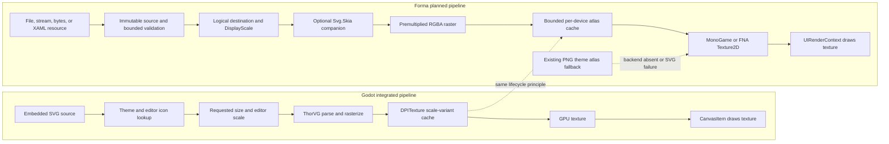

# Runtime SVG Rendering Implementation Plan

## Why This Matters to Forma Users

Runtime SVG support lets applications load scalable icons and illustrations without preparing PNG
variants for every display density. A retained SVG should remain sharp at 1x, Retina, fractional UI
scales, and arbitrary destination sizes while preserving one logical layout size. Theme authors can
ship source vectors, applications can use the same asset from C# and compiled Forma XAML, and the
default theme can eventually render its authoritative Godot SVG inputs at the exact physical scale
instead of choosing between prebuilt 1x and 2x atlases.

The implementation must behave like a production UI resource system rather than a per-frame XML
renderer. SVG bytes are validated and parsed once, CPU rasterization is cached by physical output
size, and GPU uploads occur on the render thread into bounded device-owned atlas pages. Existing
`Texture2D` and `DrawingImage` paths remain supported, and applications that do not reference the
optional SVG backend must not acquire Skia or native assets transitively.

## Objective

Add general-purpose runtime SVG image support to Forma for MonoGame and FNA. Applications must be
able to load SVG documents from files, streams, byte memory, and compiled XAML resources; display
them through `Image`, inline-image, drawing, and theme-icon surfaces; and receive crisp output at the
active physical display scale.

Use optional runtime-matched companion packages, provisionally `Forma.Svg.MonoGame` and
`Forma.Svg.FNA`, backed by Svg.Skia/SkiaSharp. Consume the latest validated stable Svg.Skia release
from NuGet and pin its compatible SkiaSharp/native-asset versions centrally. Keep backend-neutral
source contracts, control integration, cache diagnostics, and missing-backend behavior in core
`Forma`. Referencing `Forma.MonoGame` or `Forma.FNA` alone must continue to work without resolving or
copying Skia native assets.

Follow Godot's useful lifecycle model without copying its API: retain source data, generate a raster
for the requested scale, cache scale variants, keep logical dimensions stable, and draw regular GPU
textures. Forma should not reparse XML, rerasterize, allocate a texture, or upload pixels on warm
frames.

This plan extends rather than replaces:

- [Default theme icons](default-theme-icons-plan.md), which owns imported Godot icon provenance,
  bindings, and the current deterministic PNG fallback.
- [Backend-neutral drawing and compositing](../docs/adr/0004-backend-neutral-drawing-and-compositing.md),
  which owns `DrawingImage`, geometry, effects, and finite rendering limits.
- [MonoGame and FNA compatibility](monogame-fna-compatibility-plan.md), which owns peer package and
  runtime-matrix policy.

## Decision Summary

- **Rendering model:** parse once, rasterize at the requested physical size, cache, and draw a GPU
  atlas region. Do not interpret SVG or tessellate its scene tree on every frame.
- **SVG backend:** use Svg.Skia from its official NuGet package and pin compatible
  SkiaSharp/native-asset versions centrally. Do not expose Skia types in Forma's public API.
- **Dependency provenance:** use an `external/Svg.Skia` submodule only when a reproducible required
  fixture, platform, packaging, trimming, or NativeAOT blocker cannot be fixed through supported
  package configuration. A source fallback requires a pinned commit, documented patch, upstream
  issue or pull request, CI parity with the package path, and explicit removal criteria.
- **Package boundary:** keep contracts and consumers in core; ship parser/rasterizer implementation
  and native dependencies in optional runtime-matched `Forma.Svg.*` companions.
- **Source ownership:** immutable SVG source objects own copied bytes and metadata, never a graphics
  device or texture. Device caches own textures and atlas pages.
- **DPI model:** layout uses logical units. Raster dimensions derive from destination logical size,
  `UIContext.DisplayScale`, and a bounded scale quantization policy.
- **Color model:** preserve SVG colors and alpha in premultiplied sRGB RGBA output. Existing control
  tint/modulation applies after rasterization.
- **Cache model:** use bounded per-device RGBA atlas pages with transparent padding, LRU eviction,
  frame-safe disposal, diagnostics, and deterministic cache keys.
- **Threading model:** source validation and CPU parsing/rasterization may run off-thread after the
  synchronous correctness path is proven. `Texture2D` creation and `SetData` remain on the render
  thread.
- **Security model:** disable DTDs, entities, scripts, animation, external files, network access,
  fonts, and unbounded data URLs. Enforce source, element, dimension, recursion, and pixel budgets
  before backend parsing.
- **Public integration:** add one scalable-image source abstraction consumed by `Image`,
  `DrawingImage`/`ImageDrawing` where appropriate, inline images, and `ThemeIcon`; do not add
  SVG-specific branches to every control.
- **XAML model:** compiled XAML resolves project SVG assets to generated/embedded source factories.
  It must not perform runtime reflection, runtime XAML interpretation, or ambient filesystem lookup.
- **Theme rollout:** keep the current 1x/2x PNG atlases as the default and fallback until SVG quality,
  startup, memory, backend, package, and lifecycle gates pass. Runtime SVG support does not by itself
  authorize importing Godot editor-only icons.
- **Failure behavior:** malformed/unsupported input fails with a bounded diagnostic. A missing
  companion backend reports a specific setup error; default theme icons fall back to PNG rather than
  disappearing.

## Progress Dashboard

- [x] Phase 0: Contracts, Svg.Skia Spike, and Baselines
- [x] Phase 1: Immutable SVG Sources and Bounded Validation
- [x] Phase 2: Optional Svg.Skia Companion Packages
- [x] Phase 3: Exact-Scale Raster Cache and GPU Ownership
- [x] Phase 4: Image, Drawing, Inline, and Theme Integration
- [x] Phase 5: Compiled XAML and Asset Packaging
- [x] Phase 6: Default Theme SVG Provider and PNG Fallback
- [x] Phase 7: Catalog, Diagnostics, and Visual Approval
- [x] Phase 8: Performance, Platform, AOT, and Resilience Gates
- [x] Phase 9: Default Rollout and Documentation

Check a phase only after every task and exit criterion in that phase is complete.

### Progress Tracking Workflow

Use the existing tracker at the start and end of each implementation session:

```sh
bash ../scripts/track-forma-plan.sh plans/runtime-svg-rendering-plan.md
```

Add newly discovered required work to this document. Do not check a dashboard phase until all tasks
and exit criteria in that phase are checked.

## Success Criteria

- [x] SVGs load from file paths, streams, immutable byte memory, and compiled XAML resources without
  MGCB, XNB, or an FNA content compiler.
- [x] One source renders sharply at 1x, 1.25x, 1.5x, 1.75x, 2x, and a selected scale above 2x while
  retaining identical logical measurement.
- [x] Warm rendering performs no XML parsing, SVG scene construction, CPU rasterization, atlas-page
  allocation, texture creation, or pixel upload when source, destination size, scale, and rendering
  options are unchanged.
- [x] MonoGame and FNA expose matching public contracts and equivalent logical layout and pixels.
- [x] OpenGL, Metal, Direct3D, and Vulkan cells selected in Phase 0 pass render and lifecycle checks.
- [x] SVG source and parsed-document lifetimes are independent from graphics devices; device reset or
  disposal recreates only GPU cache state.
- [x] Cache memory, entries, hits, misses, rasterizations, uploads, evictions, failures, and last
  diagnostic are bounded and observable.
- [x] Malformed, adversarial, oversized, recursive, and externally-referencing documents fail before
  unbounded work or I/O.
- [x] Existing `Texture2D`, bitmap theme icons, and `DrawingImage` applications compile and render
  without behavioral regressions.
- [x] Core `Forma` packages do not contain or resolve Svg.Skia, SkiaSharp, or Skia native assets.
- [x] Official Svg.Skia NuGet packages are the default dependency source; any activated source
  fallback records its exact blocker, pinned upstream commit, local patch, upstream report, and
  removal condition.
- [x] Companion packages include the correct managed/native assets for every declared platform and
  reject mixed MonoGame/FNA graphs.
- [x] Trimming and NativeAOT behavior is proven for supported targets or explicitly documented as
  unsupported per target; static registration does not depend on reflection discovery.
- [x] Compiled Forma XAML can embed and reference SVG assets with deterministic diagnostics for
  missing, invalid, or duplicate assets.
- [x] `Image`, inline images, drawing surfaces, custom theme icons, and default theme icons consume
  the same scalable-source and cache path.
- [x] Current default PNG atlases remain a tested fallback and can be selected explicitly.
- [x] Catalog stories demonstrate exact-scale rendering, arbitrary resizing, color/tint, RTL icons,
  cache diagnostics, malformed input, backend absence, and bitmap fallback.

## Non-Goals

- Implement the complete SVG 2 specification in Forma's backend-neutral geometry classes.
- Draw SVG XML or traverse a Skia scene graph every frame.
- Expose `SKSvg`, `SKPicture`, `SKCanvas`, or other Skia types from public Forma APIs.
- Replace `DrawingImage`; it remains the native retained vector-composition API.
- Replace application-owned `Texture2D` content or remove the existing theme PNG atlases in the MVP.
- Import Godot editor icons merely because runtime SVG support exists.
- Support scripts, event handlers, SMIL/CSS animation, embedded web content, external network
  resources, arbitrary fonts, or SVG filters in the first release.
- Add an SVG editor, DOM mutation API, or CSS engine intended for browser compatibility.
- Create graphics resources or call `Texture2D.SetData` from worker threads.
- Integrate ThorVG or maintain multiple production SVG backends in the first release; approval is
  based on Svg.Skia output across Forma's supported runtimes and visual baselines.

## Current State

### Existing Strengths

- `ThemeIcon` already represents either a texture-atlas region or a `DrawingImage` with stable
  logical dimensions.
- `Image`, inline images, and `ImageDrawing` already distinguish bitmap and retained-vector sources.
- `DrawingPath.Parse` handles SVG path commands, including arcs, and the drawing layer supports
  transforms, fill rules, fills, strokes, gradients, clipping, opacity, and bounded effects.
- `UIContext.DisplayScale` separates logical UI coordinates from physical rendering pixels.
- `DynamicGlyphCache` provides a proven bounded atlas, diagnostics, render-thread upload, and LRU
  lifecycle pattern that can be generalized or mirrored for RGBA SVG rasters.
- The default icon pipeline retains authoritative SVG inputs and deterministic metadata while
  embedding 1x/2x PNG atlases as a stable fallback.
- `Forma.DynamicText.*` demonstrates runtime-matched optional companion packaging and static package
  initialization without making native dependencies transitive from core.

### Existing Gaps

- There is no public SVG document/source type or backend registration contract.
- `DrawingImage` is an authored Forma object graph, not an SVG parser or exact-scale raster cache.
- The default icon pipeline uses build-time Svg.Skia and only emits 1x/2x PNG atlases.
- `Image` and `ThemeIcon` have no common general scalable-source abstraction beyond
  `DrawingImage`.
- The drawing path retessellates geometry during rendering and is not a substitute for a cached SVG
  image renderer.
- Compiled XAML has no SVG asset item or URI/resource conversion contract.
- There are no SVG security budgets, cache diagnostics, device-reset tests, or package-native-asset
  gates.

## Target Architecture

```text
file / stream / bytes / compiled XAML resource
                       |
                       v
             immutable SvgImageSource
       bytes + hash + intrinsic size + metadata
                       |
        bounded validation and backend parse
                       |
                       v
             backend document handle
        (no public Skia types, no GPU ownership)
                       |
 logical destination + DisplayScale + options
                       |
                       v
          exact physical raster cache key
                       |
          CPU rasterization to premultiplied
                    RGBA pixels
                       |
              render-thread upload
                       |
                       v
        bounded per-device RGBA atlas pages
                       |
                       v
             regular textured UI draw
```

### Godot and Forma Approach Comparison

Both approaches retain SVG source, rasterize for the required physical scale, cache the result, and
submit ordinary textures to the graphics backend. The main difference is ownership: Godot integrates
ThorVG and `DPITexture` into the engine, while Forma uses Svg.Skia in an optional companion and owns
a backend-neutral, bounded texture cache with PNG fallback. This is an architecture comparison, not
an open backend selection.



| Concern | Godot | Forma |
| --- | --- | --- |
| SVG backend | ThorVG integrated into the engine | Svg.Skia in optional runtime-matched companions |
| Source | Embedded engine/editor SVG strings | Files, streams, bytes, compiled XAML, and theme resources |
| Scale input | Requested size and editor/UI scale | Final logical destination and `UIContext.DisplayScale` |
| Cache | `DPITexture` scale variants | Bounded physical-size variants in per-device RGBA atlases |
| Final draw | Regular texture through CanvasItem | Regular `Texture2D` through `UIRenderContext` |
| Dependency policy | SVG renderer ships with the engine | Core packages remain free of Skia/native dependencies |
| Failure/fallback | Engine-managed icon/resource fallback | Structured error for app SVGs; existing PNG atlas for theme icons |

### Provisional Public Concepts

Names are provisional until Phase 0 API review; responsibilities are not.

- `ScalableImageSource`: backend-neutral immutable source contract with logical/intrinsic size and a
  stable content identity. `DrawingImage` may implement or adapt to this contract.
- `SvgImageSource`: immutable SVG bytes and metadata, with `FromFile`, `FromStream`, and `FromMemory`
  factories. It must not expose a mutable XML DOM.
- `SvgLoadOptions`: external-resource policy, unsupported-feature policy, color substitutions,
  preferred color space, and source budgets. Defaults are secure and deterministic.
- `SvgRenderOptions`: preserve-aspect behavior, interpolation, optional color map/current-color
  policy, and scale quantization. Controls should normally use defaults.
- `SvgDiagnostics`: parse/raster/cache counters and the last bounded failure.
- `ISvgRasterizerBackend`: internal companion boundary installed statically without runtime
  reflection. It accepts validated bytes and returns opaque backend documents and RGBA raster data.
- `SvgRasterCache`: internal device-scoped atlas/cache service owned by `UIRenderContext` or a
  weak-keyed device cache.

The API review must decide whether `SvgImageSource` lives in core with a missing-backend diagnostic,
or in the companion with a core `ScalableImageSource` base. Core must not reference the companion;
the companion may reference core and receive `InternalsVisibleTo` access where necessary.

### Cache Key and Scale Rules

A raster-cache key must include:

- stable source content hash and backend/document generation;
- destination physical width and height after aspect-ratio resolution;
- color substitution/current-color inputs that affect raster pixels;
- rendering quality/options and backend version;
- any source fragment identifier supported by the MVP.

Tint applied by `SpriteBatch` is not part of the key when it is a post-raster multiply.

- Logical measurement comes from intrinsic `width`/`height`, then `viewBox`, then an explicit
  fallback policy approved in Phase 0.
- Physical raster size derives from the final logical destination and `DisplayScale`, not only the
  SVG's intrinsic size.
- Scale variants are quantized to a documented bounded step, initially evaluate exact integer pixel
  dimensions versus Godot-like $1/64$ scale quantization.
- Cache entries receive at least two physical pixels of transparent padding at the selected scale to
  prevent linear-filter bleed.
- Raster dimensions, area, atlas-page dimensions, page count, total bytes, and entries per source
  are capped. Oversized requests fail or use a documented bounded fallback; they never allocate
  opportunistically past the limit.
- Eviction is least-recently-used and cannot evict an atlas page referenced in the active frame.

## SVG Feature Envelope

Phase 0 must lock a tested MVP matrix rather than claim generic SVG compatibility.

### Required MVP

- [x] Root `svg`, nested `g`, `defs`, and `use` with bounded local references.
- [x] `width`, `height`, `viewBox`, and `preserveAspectRatio`.
- [x] `path`, `rect`, rounded rect, circle, ellipse, line, polyline, and polygon.
- [x] Solid fill/stroke, opacity, fill/stroke opacity, fill rules, line caps, line joins, miter limit,
  and dash arrays.
- [x] Inline presentation attributes and a bounded subset of embedded/inline CSS required by the
  approved fixtures.
- [x] Translate, scale, rotate, skew, and matrix transforms.
- [x] Linear and radial gradients with local references, spread methods, transforms, and opacity.
- [x] Local clip paths and masks needed by the approved fixture set.
- [x] `currentColor` and deterministic post-raster tint support for theme assets.

### Explicitly Deferred or Rejected for MVP

- [x] Text and external fonts are rejected for the MVP; reconsider later only with an
  application-supplied font policy.
- [x] Filters, blur, shadows, blend modes, and arbitrary compositing beyond approved backend output.
- [x] Embedded raster images and data URLs.
- [x] External `href`, file paths, network URLs, stylesheets, and linked documents.
- [x] Scripts, event attributes, animation, foreign objects, and interactive DOM behavior.
- [x] ICC profiles, color-managed print behavior, and browser layout semantics.

Unsupported required content must produce a source-specific diagnostic. It must not silently omit a
security-sensitive or layout-significant element unless the selected policy explicitly requests
best-effort rendering.

## Phase 0: Contracts, Svg.Skia Spike, and Baselines

### Tasks

- [x] Record the motivating visual baselines: Godot runtime arrow, Godot editor Tree arrow, Forma
  1x/2x atlas output, and Forma output at 1.25x, 1.5x, 1.75x, and 2x.
- [x] Select representative SVG fixtures covering the required feature envelope, malformed input,
  high path complexity, gradients, clips, transforms, `use`, current color, and unsupported content.
- [x] Upgrade the existing build-time icon pipeline to Svg.Skia 5.2.0 and matching SkiaSharp 4.148.0
  packages, regenerate its 67-icon 1x/2x atlases, and pass the focused icon pipeline tests.
- [x] Spike Svg.Skia runtime parsing/rasterization on macOS arm64, Windows x64, and Linux x64, then
  verify the additional declared RIDs.
- [x] Measure managed/native package size, cold parse time, cold raster time, warm lookup time, RGBA
  memory, and output differences between MonoGame and FNA.
- [x] Compare Svg.Skia output with equivalent authored `DrawingImage` fixtures to establish visual
  and performance baselines; do not implement a second SVG parser as a fallback.
- [x] Decide and document the public source abstraction, backend registration boundary, missing
  backend behavior, disposal semantics, and thread-safety contract.
- [x] Lock source, XML, element, reference, recursion, dimension, pixel, cache, and diagnostic limits.
- [x] Lock the MVP feature matrix and unsupported-feature policy.
- [x] Decide exact pixel-size versus $1/64$ scale quantization using visual and cache-cardinality data.
- [x] Define backend/platform cells and visual tolerance thresholds for MonoGame and FNA.
- [x] Add an ADR for runtime SVG architecture, package boundaries, security policy, and cache limits.

### Exit Criteria

- [x] Svg.Skia renders every required fixture and rejects every forbidden fixture on the initial
  macOS, Windows, and Linux spike cells.
- [x] Public API and package-boundary review is complete with no public Skia types.
- [x] Baseline images and measurements are committed with reproducible commands.
- [x] Finite limits and failure behavior are approved before parser integration begins.

## Phase 1: Immutable SVG Sources and Bounded Validation

### Tasks

- [x] Add immutable source factories for file, stream, and byte memory with defensive copies and a
  stable SHA-256 identity.
- [x] Enforce maximum source bytes before copying or parsing.
- [x] Add a secure XML preflight using `XmlReader` with DTD/entity resolution disabled and no
  external resolver.
- [x] Count elements, attributes, text bytes, nesting depth, local references, and declared
  dimensions during preflight; reject budget violations deterministically.
- [x] Reject scripts, event handlers, animation, foreign objects, external references, network/file
  URLs, unsupported data URLs, and non-finite numeric values.
- [x] Parse intrinsic dimensions, `viewBox`, and preserve-aspect metadata without constructing GPU
  state.
- [x] Define source equality and lifetime independently from parsed backend handles and devices.
- [x] Provide structured error codes plus concise diagnostics without retaining full untrusted source
  text.
- [x] Add fuzz/property tests for malformed XML, numeric extremes, cyclic references, and deep
  nesting.

### Exit Criteria

- [x] Validation tests cover every budget and forbidden-feature class.
- [x] Source loading performs no graphics operation and is safe before a `UIContext` exists.
- [x] Equivalent bytes produce equivalent identity and metadata across runtimes and operating systems.

## Phase 2: Optional Svg.Skia Companion Packages

### Tasks

- [x] Add runtime-matched companion projects and package IDs for MonoGame and FNA.
- [x] Pin compatible Svg.Skia, SkiaSharp, and native-asset versions in central build properties.
- [x] Consume Svg.Skia through the official NuGet package in normal restore, build, test, pack, trim,
  and NativeAOT workflows.
- [x] Define the source-fallback activation gate: reproduce a required NuGet-path blocker in a small
  fixture, confirm supported package configuration cannot resolve it, and record the decision.
- [x] If that gate is met, add `external/Svg.Skia` as a pinned submodule, keep the local patch minimal,
  link its upstream issue or pull request, test package/source parity, and document when to remove it.
- [x] Implement the internal backend contract with opaque parsed-document handles and deterministic
  premultiplied sRGB RGBA raster output.
- [x] Install the backend through a static/module initializer pattern that is trimming/AOT visible and
  does not use reflection scanning.
- [x] Reject loading both runtime peers or incompatible SVG backend versions in one graph.
- [x] Add package guards and isolated consumers proving correct runtime/native asset selection.
- [x] Keep all Svg.Skia/SkiaSharp references out of core package dependency and file lists.
- [x] Add a backend health probe that reports backend name, version, native availability, and supported
  feature flags without creating a graphics device.
- [x] Document explicit backend replacement hooks only if the Phase 0 spike proves a realistic need;
  do not freeze an abstraction solely for hypothetical engines.

The official Svg.Skia 5.2.0 package path passes the focused fixture suite, package/RID matrix,
trimming, and NativeAOT consumers without a source-level patch. The source-fallback gate is therefore
not met: no `external/Svg.Skia` submodule is activated. The backend registry remains internal and
single-assignment because the spike found no realistic replacement requirement.

### Exit Criteria

- [x] Core-only consumers build, publish, and run without Skia assemblies or native assets.
- [x] Companion consumers parse and rasterize the fixture set on both runtime peers.
- [x] Package-content and mixed-runtime rejection tests pass for every declared RID.

## Phase 3: Exact-Scale Raster Cache and GPU Ownership

### Tasks

- [x] Add a bounded CPU document/raster cache keyed by source identity, physical dimensions, and
  render-affecting options.
- [x] Reuse or extract the proven skyline allocation and frame-safe LRU concepts from
  `DynamicGlyphCache` without coupling SVG and font diagnostics.
- [x] Use premultiplied RGBA atlas pages with transparent padding and linear clamp sampling.
- [x] Keep parse/raster work separate from render-thread `Texture2D` creation and uploads.
- [x] Start with synchronous first-use rendering for deterministic correctness; add queued worker
  rasterization and preload APIs only after fallback and cancellation behavior are specified.
- [x] Batch or bound uploads so one frame cannot exceed an approved byte/time budget.
- [x] Recreate GPU pages after device reset from retained sources or CPU cache entries.
- [x] Keep one bounded zero-owner cache reusable per graphics device and dispose its pages from
  `GraphicsDevice.Disposing`; never let source objects dispose shared textures. FNA SDL_GPU applies
  sampler changes lazily and exposes no portable post-present fence, so mid-device final-page release
  is unsafe even after a renderer-owned sampler transition.
- [x] Expose diagnostics for documents, variants, pages, bytes, hits, misses, rasterizations, uploads,
  evictions, failures, pending work, and last failure.
- [x] Add explicit cache clearing and optional prewarm APIs on `UIContext`.

### Exit Criteria

- [x] Warm-frame tests prove zero parse, raster, allocation, texture creation, and upload work.
- [x] Cache budgets and frame-safe eviction are covered by deterministic unit tests.
- [x] Device reset/disposal tests pass without stale texture use or source loss.
- [x] MonoGame and FNA render equivalent atlas-backed output at all selected scales.

## Phase 4: Image, Drawing, Inline, and Theme Integration

### Tasks

- [x] Introduce one scalable-source property/path shared by `Image` and existing image layout logic.
- [x] Preserve source precedence and compatibility between `Texture2D`, `DrawingImage`, and SVG.
- [x] Integrate scalable sources with `ImageDrawing`/`DrawingImage` composition where it does not
  create recursive or per-frame raster behavior.
- [x] Add scalable inline images to rich text with shared intrinsic measurement and baseline rules.
- [x] Extend `ThemeIcon` to reference a general scalable source while preserving existing
  constructors and value semantics.
- [x] Route all SVG draws through one `UIRenderContext` helper for cache lookup, tint, clipping,
  destination rounding, and fallback.
- [x] Verify stretch modes, aspect-ratio modes, alignment, source fragments if supported, opacity,
  tint, clipping, transforms, RTL placement, and disabled-state modulation.
- [x] Add clear behavior when no SVG backend is installed: application SVGs report a setup error;
  default theme SVGs resolve their PNG fallback.
- [x] Add accessibility semantics only at the consuming control/image level; SVG `<title>` and
  `<desc>` may provide optional metadata but must not replace explicit application labels.

### Exit Criteria

- [x] All consuming surfaces measure from the same intrinsic metadata and render from the same cache.
- [x] Existing bitmap/vector API tests remain source-compatible and pass unchanged where possible.
- [x] Render tests cover tint, scale, clipping, transforms, inline layout, theme lookup, RTL, and
  backend absence on both runtimes.

## Phase 5: Compiled XAML and Asset Packaging

### Tasks

- [x] Define one compiled-XAML syntax for SVG assets, for example a typed `SvgImageSource` resource
  or an `{Svg ...}` extension, and approve it before implementation.
- [x] Add an MSBuild SVG asset item that assigns deterministic logical resource names and embeds or
  generates source factories without MGCB/XNB.
- [x] Resolve relative asset references against the XAML source at build time, not the process
  working directory at runtime.
- [x] Generate compile-time diagnostics for missing files, duplicate logical names, invalid SVGs,
  forbidden features, and size-budget violations.
- [x] Ensure hot reload replaces source generations and invalidates only affected parsed/raster cache
  entries.
- [x] Preserve source provenance and deterministic package output.
- [x] Add compiler, build-integration, hot-reload, and isolated-package consumer tests.

### Exit Criteria

- [x] C# and compiled-XAML paths create equivalent source identities, intrinsic sizes, and pixels.
- [x] Clean builds do not depend on the current directory or an installed content compiler.
- [x] Invalid assets fail during build when statically known, with file and line context where
  available.

## Phase 6: Default Theme SVG Provider and PNG Fallback

### Tasks

- [x] Extend the generated theme manifest so each logical icon can resolve authoritative SVG bytes
  plus the existing PNG density entries and provenance.
- [x] Package SVG sources only in the companion/provider layer if doing so keeps core-only package
  budgets and fallback independence intact.
- [x] Install a default-theme SVG provider when the compatible companion is present; otherwise retain
  current PNG atlas behavior.
- [x] Preserve all icon names, type bindings, states, RTL mappings, logical dimensions, and explicit
  application overrides.
- [x] Add a context-level policy: `BitmapAtlas`, `RuntimeSvg`, and `Auto`, with a stable documented
  default during rollout.
- [x] Ensure backend failure or unsupported SVG features fall back per icon without rebuilding or
  replacing the entire theme.
- [x] Compare runtime SVG output against current PNG atlases and approved Godot references at all
  selected scales.
- [x] Keep Godot editor-only assets excluded unless a separate provenance/design change explicitly
  imports them.
- [x] Update icon diagnostics to distinguish SVG source hits, PNG fallbacks, and missing icons.

### Exit Criteria

- [x] Every existing default icon renders through both runtime SVG and explicit PNG policies.
- [x] Overrides, suppression, inheritance, state changes, and RTL behavior are identical between
  policies.
- [x] A missing or failed companion never leaves a default control without its current PNG icon.

## Phase 7: Catalog, Diagnostics, and Visual Approval

### Tasks

- [x] Reference the matching SVG companion from the runtime-specific Catalog executables:
  `Forma.Svg.MonoGame` from `Forma.Catalog.MonoGame` and `Forma.Svg.FNA` from
  `Forma.Catalog.FNA`. Use project references in the repository and verify that each executable
  copies only its compatible managed and native backend assets.
- [x] Explicitly root and activate the matching SVG backend during Catalog startup through the
  trimming/NativeAOT-safe registration or health-probe API; do not assume that an otherwise-unused
  assembly reference will be loaded or preserved automatically.
- [x] When the backend health probe succeeds, start the Catalog `UIContext` with the runtime SVG
  default-theme policy so ordinary stories, including Tree/DataGrid hierarchy arrows, exercise SVG
  rendering without per-control setup. Keep an in-app policy control for `RuntimeSvg`,
  `BitmapAtlas`, and `Auto` comparisons.
- [x] Add a Runtime SVG story with file/embedded sources, arbitrary resizing, scale controls,
  preserve-aspect modes, tint, gradients, clipping, and transforms.
- [x] Add a comparison story for source SVG, current 1x/2x atlas, exact-scale runtime output, and a
  `DrawingImage` fixture.
- [x] Add default-theme policy controls and show runtime SVG versus PNG fallback for representative
  controls including Tree/DataGrid hierarchy arrows.
- [x] Add cache diagnostics and atlas-page inspection without exposing backend-native objects.
- [x] Demonstrate malformed/unsupported input and missing-backend behavior with concise UI state.
- [x] Capture approved screenshots at 1x, fractional scales, Retina 2x, RTL, and narrow layout for
  MonoGame and FNA.
- [x] Add objective edge/coverage metrics alongside human visual approval; do not approve sharpness
  solely from screenshots viewed at rescaled editor zoom.

### Exit Criteria

- [x] MonoGame and FNA Catalog executables report the expected healthy backend and native asset,
  render at least one default Tree hierarchy arrow through runtime SVG, and expose an SVG cache hit
  in diagnostics; package presence or a PNG fallback alone does not satisfy this criterion.
- [x] Catalog stories expose every user-facing behavior and failure mode.
- [x] Cross-runtime screenshots meet approved pixel tolerances and manual quality review.
- [x] The motivating hierarchy arrow is demonstrably sharper or equivalent at fractional/Retina
  scales without changing logical row geometry.

## Phase 8: Performance, Platform, AOT, and Resilience Gates

### Tasks

- [x] Benchmark cold source validation, parse, first raster, first upload, warm lookup, and sustained
  mixed-size rendering.
- [x] Set and enforce startup, frame-time, allocation, package-size, native-size, CPU-cache, GPU-cache,
  and upload budgets.
- [x] Run lifecycle tests for context sharing, context disposal order, device reset/loss, display-scale
  changes, hot reload, cache eviction, and repeated backend failure.
- [x] Run malformed/adversarial corpus and fuzz tests under time and memory limits.
- [x] Validate selected MonoGame OpenGL/Direct3D/Vulkan and FNA Metal/OpenGL cells sequentially where
  required by native graphics state.
- [x] Validate Windows, Linux, and macOS RIDs plus any mobile/console targets declared supported by
  the companion package.
- [x] Run trimming and NativeAOT analyzers and executable probes for both core-only and companion
  consumers.
- [x] Validate official-package provenance in every release cell and, only when the source fallback
  is active, run the same package, trimming, and NativeAOT matrix against the pinned submodule build.
- [x] Verify deterministic package contents, licenses, notices, Source Link, symbols, and native asset
  layout.
- [x] Confirm no warm-frame backend calls for unchanged SVGs using diagnostics and allocation evidence.

### Exit Criteria

- [x] All declared runtime/backend/RID cells meet correctness and lifecycle gates.
- [x] Core-only and companion package graphs meet size and dependency budgets.
- [x] Security corpus completes within finite time and memory with no external I/O.
- [x] Warm-frame and cache-cardinality budgets pass at fractional display scales.

## Phase 9: Default Rollout and Documentation

### Tasks

- [x] Publish API documentation for source loading, package selection, XAML assets, scaling, cache
  behavior, security restrictions, diagnostics, prewarming, and disposal.
- [x] Update `docs/theme-icons.md` to describe runtime SVG policy and PNG fallback accurately.
- [x] Add migration examples from `Texture2D`, atlas theme icons, and authored `DrawingImage`.
- [x] Document supported SVG features and deterministic diagnostics; avoid the phrase “full SVG
  support.”
- [x] Decide whether `Auto` selects runtime SVG by default only after every Phase 8 gate passes.
  Keep `BitmapAtlas` as the MVP `UIContext` default. `Auto` remains an explicit opt-in that selects
  runtime SVG when the companion is healthy, preserving native-free startup and immediate rollback.
- [x] Retain an explicit bitmap policy for deterministic/pixel-art/native-free consumers.
- [x] Update release notes, third-party notices, package examples, and runtime-support tables.
- [x] Run `make check` and the full platform/runtime validation target defined by the compatibility
  plan.

### Exit Criteria

- [x] Documentation matches shipped packages and measured runtime support.
- [x] Default policy has an approved rollback path and does not break core-only consumers.
- [x] All success criteria are checked with linked evidence in this plan or companion docs.

### Final Validation Evidence

- Exact implementation snapshot: `cd94582436e3ad8065262d8f5c9507ea03d98abe`.
- GitHub Actions run: [CI 31110056321](https://github.com/zigrok/Forma/actions/runs/31110056321),
  successful on 2026-08-06.
- Native execution passed for MonoGame OpenGL, WindowsDX, Native Vulkan, and Native Metal plus FNA
  OpenGL, D3D11, and Metal across hosted Linux x64, Windows x64, and macOS arm64 cells.
- The same run passed official NuGet provenance and package consumers, MonoGame/FNA parity, trim-only
  consumers, and NativeAOT. No Svg.Skia source fallback was active.
- Local `make check`, focused 49-test SVG suites per peer, lifecycle smoke, XAML fixtures, package
  consumers, deterministic visual baselines, and the final plan tracker passed before completion.

## Initial Validation Matrix

| Area | Required evidence |
| --- | --- |
| Source loading | File, stream, bytes, embedded resource, empty/truncated/oversized input |
| Security | DTD/entity, script, event attribute, external href, network/file URI, deep nesting, cycles |
| Geometry | Paths/arcs, basic shapes, transforms, fill rules, caps/joins/dashes |
| Paint | Solid, opacity, current color, color substitution, linear/radial gradients |
| Layout | Width/height, viewBox-only, preserveAspectRatio modes, missing dimensions |
| Scale | 1x, 1.25x, 1.5x, 1.75x, 2x, selected >2x scale |
| Consumers | Image, inline image, drawing, custom ThemeIcon, default theme icon |
| Cache | Hit/miss, variant key, bounded pages, upload budget, eviction, clear, prewarm |
| Lifecycle | Shared device, disposal order, reset/loss, hot reload, backend missing/failure |
| Runtime | MonoGame and FNA logical parity and pixel tolerance |
| Packaging | Core-only, companion, mixed-runtime rejection, trimming, AOT, native RIDs |

## Primary Implementation Surfaces

Expected ownership, subject to Phase 0 API review:

- `src/Forma/Primitives.cs`: scalable theme-icon source contract.
- `src/Forma/VisualPrimitives.cs`: scalable image/drawing integration.
- `src/Forma/UIRenderContext.cs`: shared draw path and device cache ownership.
- `src/Forma/UIContext.cs`: policy, diagnostics, clear, and prewarm APIs.
- `src/Forma/DynamicGlyphAtlas.cs`: extraction/reuse candidate for bounded atlas infrastructure.
- `src/Forma/DefaultThemeIconResources.cs`: SVG provider selection and PNG fallback.
- `src/Forma/Resources/ThemeIcons`: generated source/fallback manifest metadata.
- `src/Forma.Svg`: optional backend and runtime-matched package project.
- `src/Forma.Xaml.Compiler` and `src/Forma.Xaml.Build`: compiled SVG asset handling.
- `tools/Forma.IconPipeline`: manifest/source generation and drift verification.
- `samples/Forma.Catalog`: stories, policy controls, and diagnostics.
- `tests/Forma.Tests`, `tests/Forma.RenderTests`, and package consumers: unit, pixel, lifecycle,
  packaging, trimming, and AOT coverage.

## Risks and Mitigations

- **Native package growth:** isolate Skia in optional companions and preserve core-only tests.
- **Fractional-scale cache explosion:** quantize scale/pixel dimensions, cap variants per source, and
  expose evictions/cardinality.
- **First-use hitch:** prove synchronous correctness first, then add bounded preload/worker paths with
  render-thread uploads.
- **Atlas fragmentation:** use padded skyline pages, bounded page sizes, and page-level frame-safe LRU
  eviction.
- **Backend output drift:** pin versions, retain fixtures/baselines, and compare both runtime peers in
  CI.
- **Upstream package blocker:** prefer supported NuGet configuration; activate a pinned Svg.Skia
  submodule only with a reproducible blocker, minimal patch, upstream report, CI parity, and removal
  condition.
- **Source-fallback drift:** keep the submodule optional and temporary, track upstream resolution,
  and regularly prove that the official package path can replace it.
- **Untrusted SVG complexity:** secure preflight, strict feature policy, finite budgets, no external
  resolver, and fuzzing.
- **Silent unsupported content:** structured diagnostics and strict-by-default loading.
- **Device lifecycle bugs:** keep source/document state device-neutral and test reset/disposal order.
- **Public API overfitting to Skia:** use immutable source and raster backend contracts with no native
  public types.
- **Regression in default controls:** retain per-icon PNG fallback and defer default policy change
  until all rollout gates pass.
